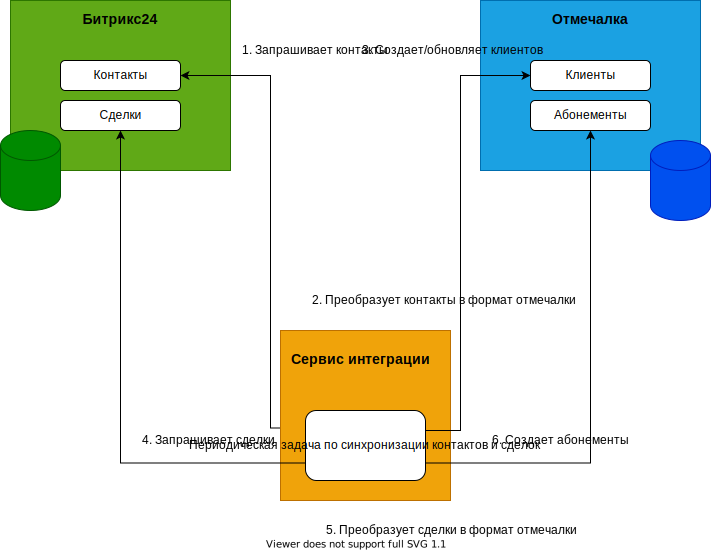

# Интеграция Bitrix24 и otmechalka.com

Целью интеграции является автоматическая передача информации между системами, что позволить убрать большую долю ручного труда.

## Участвующие системы

- *Bitrix24 (B24)* - CRM-система, работа с воронкой продаж.
- *otmechalka.com* - CRM-система для автоматизации спортивных и учебных центров. В ней тренеры отмечают посещения занятий учениками, ведется учет абоменентов и оставшихся занятий, расчет оплаты и т.д.
- *Integration Service (IS)* - Промежуточный сервис, который нам нужно разработать для интеграции между первыми двумя системами.

## Направления интеграции

- Передача из Bitrix24 в otmechalka.com информации о клиентах.
- Передача из Bitrix24 в otmechalka.com информации о купленных абонементах.
- Передача из otmechalka.com в Bitrix24 информации о заканчивающихся абонементах (приоритет ниже, сделаем на следующем этапе, пока в документе не описано)

## Сущности в B24

В B24 поддерживаем следующую струкутуру сущностей:

- Контакт. Каждому ученику соответствует один контакт. В контакте отдельно заполняются поля с данными ученика и отдельно поля с данными родителя. Если обучается взрослый, то все равно нужно заполнить и данные родителя и данные ученика. Возникает дублирование, но это не страшно, т.к. взрослых обучается всего 2%. При этом если у родителя обучается несколько детей, то для каждого из них создается отдельный контакт и информация о родителе заполняется в каждом из них.
- Сделка. К каждому контакту привязываются сделки, например, покупка абонементов, участие в турнирах и т.д. Не все сделки участвуют в интеграции, интересуют только абонементы. Важно, чтобы к контакту были привязаны покупки абонемента именно для этого ученика, т.к. связь абонемента с учеником должна быть однозначной. В противном случае, например, если обучаются несколько детей одного родителя и все абонементы привязываются только к одному контакту, невозможно автоматически определить, какой абонемент к какому ученику относится и, соответственно, невозможно провести автоматическую интеграцию.

### Статус синхронизации

В B24 для синхронизируемых сущностей, перечисленных выше, нужно добавить текстовое поле "Статус синхронизации". Его будет заполнять процесс синхронизации. Если синхронизация завершена успешно, то будет записано значение "Успешно", если произошла ошибка, то будет записан текст ошибки. По этому полю можно строить отчеты для поиска проблемных контактов, для которых требуется корректировка данных или ручной перенос.

### Правила заполнения полей контакта

- Фамилия и имя контакта (родителя) должны быть заполнены и должны находится в соответствующих полях. Не должно быть, например такого: NAME=="Наталья Зарудная", LAST_NAME=="".
- Фамилия и имя ребенка - аналогично.

### Правила заполнения полей сделки

## Сущности в отмечалке

В отмечалке есть две основные сущности:

- Посетитель. Соответствует контакту в B24. Ограничение на число активных (не архивных) посетителей - 5000.
- Абонемент. Соответствует сделке в B24.

## Архитектура интеграции

IS хостится отдельно, в облаке.

IS сам вызывает B24 и отмечалку, а сам никакого API не выставляет.

IS состоит из следующих частей:

- Периодическая задача CONTACT_SYNC_JOB для синхронизации контактов
- Периодическая задача DEAL_SYNC_JOB для синхронизации сделок.



## API B24. Входящие вебхуки

Входящие вебхуки используются для вызова REST-подобного API на стороне B24. B24 генерирует уникальную ссылку, которая связана с определенным методом API. В этой ссылке фигурирует ID пользователя B24, поэтому, чтобы не привязываться к реальным людям, нужно создать технического пользователя, от имени которого будет работать интеграция. Вебхуки вызываются по HTTP/1.1 GET.

Назначение полей вида `UF_CRM_1492515480` можно понять, сделав и вызвав вебхук на метод `crm.<entity>.fields` (например, `crm.contact.fields`). Но в логике работы интеграции он не используется, т.к. назначение полей строго задается в настройках Интеграционного сервиса. Т.е., например, указывается, что поле `UF_CRM_1492515480` у контакта - это ссылка на тренера.

Вебхуки создаются под техническим пользователем TODO.

В нашем случае применяются следующие входящие вебхуки:

### Получение списка контактов (crm.contact.list)

Пример запроса:
`GET https://rshsh.bitrix24.ru/rest/23748/wgkqhxezug8efpm7/crm.contact.list.json?filter[%3EDATE_CREATE]=2020-12-20T09:54:41`

`%3E` - это символ `>`

Пример ответа:

``` json
{
    "result": [
        {
            "ID": "39910",
            "POST": null,
            "COMMENTS": "комментарий",
            "HONORIFIC": null,
            "NAME": "Елена",
            "SECOND_NAME": "",
            "LAST_NAME": "Зарудная",
            "PHOTO": null,
            "LEAD_ID": "133892",
            "TYPE_ID": "1",
            "SOURCE_ID": "55",
            "BIRTHDATE": "2014-11-26T03:00:00+03:00",
            "EXPORT": "Y",
            "DATE_CREATE": "2020-12-20T11:06:11+03:00",
            "DATE_MODIFY": "2020-12-21T10:19:34+03:00",
            // ...
            "UF_CRM_1470852549": [
                348
            ],
            "UF_CRM_1470854727": [
                62
            ],
            "PHONE": [
                {
                    "ID": "322540",
                    "VALUE_TYPE": "WORK",
                    "VALUE": "9265672098",
                    "TYPE_ID": "PHONE"
                }
            ]
            // ...
        },
        {
            "ID": "39912",
            "POST": null,
            "COMMENTS": "комментарий",
            "HONORIFIC": null,
            "NAME": "Василий",
            "SECOND_NAME": "",
            "LAST_NAME": "Свеклов",
            "PHOTO": null,
            "LEAD_ID": "132544",
            "SOURCE_ID": "CALL",
            "BIRTHDATE": "",
            "EXPORT": "Y",
            "DATE_CREATE": "2020-12-20T13:49:53+03:00",
            "DATE_MODIFY": "2020-12-20T13:49:53+03:00",
            // ...
            "UF_CRM_1470852549": [
                348
            ],
            "UF_CRM_1470854727": [
                62
            ],
            "PHONE": [
                {
                    "ID": "322540",
                    "VALUE_TYPE": "WORK",
                    "VALUE": "9265672098",
                    "TYPE_ID": "PHONE"
                }
            ]
        },
        // ...
    ],
    "total": 16,
    // ...
}
```

### Обновление полей контакта (crm.contact.update)

Пример запроса:
`GET https://rshsh.bitrix24.ru/rest/23748/wgkqhxezug8efpm7/crm.contact.update.json?ID=39558&FIELDS[UF_CRM_57AD7FAF7E6C4]=Успешно`

Пример ответа:

``` json
{
    "result": true,
    "time": {
        // ...
    }
}
```

Правда `"result": true` вернется, даже если передать несуществующее поле, так что об ошибках сразу узнать не получится.

### Получение списка сделок (crm.deal.list)

Пример запроса:
`GET https://rshsh.bitrix24.ru/rest/23748/wgkqhxezug8efpm7/crm.deal.list.json?filter[>DATE_CREATE]=2020-12-20T09:54:41`

`%3E` - это символ `>`

Пример ответа:

``` json
{
    "result": [
        {
            "ID": "96036",
            "TITLE": "chessrussian.ru #19148",
            "TYPE_ID": "SALE",
            "STAGE_ID": "WON",
            "PROBABILITY": "100",
            "CURRENCY_ID": "RUB",
            "OPPORTUNITY": "1500.00",
            "IS_MANUAL_OPPORTUNITY": "N",
            "TAX_VALUE": "0.00",
            "LEAD_ID": null,
            "CONTACT_ID": "37854",
            "BEGINDATE": "2020-12-20T03:00:00+03:00",
            "CLOSEDATE": "2020-12-20T03:00:00+03:00",
            "ASSIGNED_BY_ID": "932",
            "CREATED_BY_ID": "932",
            "MODIFY_BY_ID": "10390",
            "DATE_CREATE": "2020-12-20T10:01:18+03:00",
            "DATE_MODIFY": "2020-12-20T10:01:18+03:00",
            "OPENED": "Y",
            "CLOSED": "Y",
            "COMMENTS": null,
            "ADDITIONAL_INFO": "a:14:{s:17:\"CONTACT_FULL_NAME\";s:13:\"Эрнест \";s:11:\"PAYMENTDATE\";s:19:\"20.12.2020 09:57:41\";s:15:\"DELIVERYSERVICE\";s:18:\"Самовывоз\";s:32:\"МЕТОД ДОСТАВКИ ИД\";s:1:\"2\";s:13:\"PAYMENTSYSTEM\";s:31:\"Сбербанк (Москва)\";s:28:\"МЕТОД ОПЛАТЫ ИД\";s:2:\"19\";s:9:\"ORDERPAID\";b:1;s:15:\"DELIVERYALLOWED\";b:0;s:8:\"CANCELED\";b:0;s:11:\"FINALSTATUS\";b:0;s:11:\"ORDERSTATUS\";s:18:\"[P] Оплачен\";s:32:\"СТАТУСА ЗАКАЗА ИД\";s:1:\"P\";s:16:\"STATUSCHANGEDATE\";s:19:\"20.12.2020 09:57:57\";s:4:\"SITE\";s:49:\"[s1] Русская шахматная школа\";}",
            "STAGE_SEMANTIC_ID": "S",
            "IS_NEW": "N",
            "IS_RECURRING": "N",
            "IS_RETURN_CUSTOMER": "Y",
            "IS_REPEATED_APPROACH": "N",
            "SOURCE_ID": null,
            "SOURCE_DESCRIPTION": null,
            "ORIGINATOR_ID": "8",
            "ORIGIN_ID": "19148",
            // ...
            "UF_CRM_57C2E7A53C7B5": [
                580
            ],
            "UF_CRM_57C2E7A54C173": [
                202
            ],
            // ...
        },
        {
            "ID": "96038",
            "TITLE": "Зарудный Кирилл",
            "TYPE_ID": "SALE",
            "STAGE_ID": "WON",
            "PROBABILITY": "42",
            "CURRENCY_ID": "RUB",
            "OPPORTUNITY": "2520.00",
            "IS_MANUAL_OPPORTUNITY": "Y",
            "TAX_VALUE": "0.00",
            "LEAD_ID": null,
            "CONTACT_ID": "39910",
            "BEGINDATE": "2020-12-20T03:00:00+03:00",
            "CLOSEDATE": "2020-12-21T03:00:00+03:00",
            "ASSIGNED_BY_ID": "10390",
            "CREATED_BY_ID": "10390",
            "MODIFY_BY_ID": "3486",
            "DATE_CREATE": "2020-12-20T11:07:35+03:00",
            "DATE_MODIFY": "2020-12-21T10:21:16+03:00",
            "OPENED": "Y",
            "CLOSED": "Y",
            "COMMENTS": "",
            "ADDITIONAL_INFO": null,
            "STAGE_SEMANTIC_ID": "S",
            "IS_NEW": "N",
            "IS_RECURRING": "N",
            "IS_RETURN_CUSTOMER": "N",
            "IS_REPEATED_APPROACH": "N",
            "SOURCE_ID": "",
            "SOURCE_DESCRIPTION": "",
            "ORIGINATOR_ID": null,
            "ORIGIN_ID": null,
            // ...
            "UF_CRM_57C2E7A53C7B5": [
                580
            ],
            "UF_CRM_57C2E7A54C173": [
                202
            ],
            // ...
        },
        // ...
    ],
    "next": 50,
    "total": 64,
    // ...
}
```

### Получение товарных позиций сделки (crm.deal.productrows.get)

Пример запроса:
`GET https://rshsh.bitrix24.ru/rest/23748/wgkqhxezug8efpm7/crm.deal.productrows.get.json?ID=96294`

Пример ответа:

``` json
{
    "result": [
        {
            "ID": "124740",
            "OWNER_ID": "94912",
            "OWNER_TYPE": "D",
            "PRODUCT_ID": 60130,
            "PRODUCT_NAME": " 6 КМС индивидуальные 45 мин",
            "ORIGINAL_PRODUCT_NAME": " 6 КМС индивидуальные 45 мин",
            "PRODUCT_DESCRIPTION": null,
            "PRICE": 8700,
            "PRICE_EXCLUSIVE": 8700,
            "PRICE_NETTO": 9000,   // TODO чем отличается от PRICE_BRUTTO?
            "PRICE_BRUTTO": 9000,
            "PRICE_ACCOUNT": "8700.00",
            "QUANTITY": 1,
            "DISCOUNT_TYPE_ID": 1,
            "DISCOUNT_RATE": 3.3300000000000001,
            "DISCOUNT_SUM": 300,
            "TAX_RATE": 0,
            "TAX_INCLUDED": "N",
            "CUSTOMIZED": "Y",
            "MEASURE_CODE": 1,
            "MEASURE_NAME": "мес",
            "SORT": 10
        }
    ],
    "time": {
        // ...
    }
}
```

### Обновление полей сделки (crm.deal.update)

Пример запроса:
`GET https://rshsh.bitrix24.ru/rest/23748/wgkqhxezug8efpm7/crm.deal.update.json?ID=167899&FIELDS[UF_CRM_57AD7FAF7E6C4]=Успешно`

Пример ответа:

``` json
{
    "result": true,
    "time": {
        // ...
    }
}
```

### Получение информации о сотруднике (user.get)

Пример запроса:
`GET https://rshsh.bitrix24.ru/rest/23748/wgkqhxezug8efpm7/user.get.json?ID=12288`

Пример ответа:

``` json
{
    "result": [
        {
            "ID": "12288",
            "ACTIVE": true,
            "EMAIL": "employee@inbox.ru",
            "NAME": "Василий",
            "LAST_NAME": "Василенко",
            "SECOND_NAME": "",
            "USER_TYPE": "employee",
            // ...
        }
    ],
    "total": 1,
    "time": {
        // ...
    }
}
```

## API otmechalka.com

### Создание клиента

Метод создает нового клиента. Группы клиента не передаются и должны быть установлены автоматически. Клиент должен быть привязан ко всем группам, которые соответствуют переданным филиалам и направлениям.

Запрос:
`POST /api/clients/`

``` json
{
    "origin_id": "39558",              // внешний ID, по которому потом будем делать поиск
    "last_name": "Петров",
    "first_name": "Василий",
    "phone": "79261234567",
    "email": "ivan.petrov@gmail.com",  // не обязательное
    "courses": [
        "Он-лайн Групповое",           // TODO предпочтительно по ID, надо обсудить
        "Он-лайн индивидуальные"
    ],
    "branchoffices": [
        "+Он-лайн `МСК"                // TODO предпочтительно по ID, надо обсудить
    ],
    "birthdate": "2009-11-29",         // не обязательное
    "gender": "M",                     // M - мужской, F - женский
    "additional_data": "Петров Иван"   // не обязательное
}
```

Ответ:

``` json
{
    "id": 12456,
    // остальные поля контакта
}
```

### Изменение клиента

Метод изменяет клиента. Группы клиента не передаются и должны быть установлены автоматически. Клиент должен быть привязан ко всем группам, которые соответствуют переданным филиалам и направлениям.

Запрос:
`POST /api/clients/<origin_id>/`

``` json
{
    "origin_id": "39558",              // внешний ID, по которому потом будем делать поиск
    "last_name": "Петров",
    "first_name": "Василий",
    "phone": "79261234567",
    "email": "ivan.petrov@gmail.com",  // не обязательное
    "courses": [
        "10985",                       // "Он-лайн Групповое"
        "10986"                        // "Он-лайн индивидуальные"
    ],
    "branchoffices": [
        "2633"                         // "+Он-лайн `МСК"
    ],
    "birthdate": "2009-11-29",         // не обязательное
    "gender": "M",                     // M - мужской, F - женский
    "additional_data": "Петров Иван"   // не обязательное
}
```

Ответ:

``` json
{
    "id": 12456,
    // остальные поля контакта
}
```

### Получение клиента

Метод возвращает клиента по его внешнему идентификатору.

Запрос:
`GET /api/clients/<origin_id>/`

Ответ:

``` json
{
    "id": 12456,
    // остальные поля контакта
}
```

### Создание абонемента

Метод создает новый абонемент для клиента. Группы абонемента не передаются и должны быть установлены автоматически. Абонемент должен быть привязан ко всем группам, которые указаны в его типе абонемента. Этим методом можно создать только те абонементы, где заранее указано число посещений и срок действия. Переданная сделка всегда считается оплаченой.

Запрос:
`POST /api/tickets/`

``` json
{
    "origin_id": "24545676786",        // внешний ID, по которому потом будем делать поиск
    "client_origin_id": "39558",       // внешний ID клиента, для которого создается абонемент
    "ticket_type": "6 КМС индивидуальные 45 мин",  // по ID не получится, т.к. новые абомементы нельзя будет синхронизировать без доработок
    "price_initial": "9000.00",        // стоимость без скидки
    "discount": "300.00",              // сумма скидки
    "price_final": "8700.00",          // стоимость со скидкой
    "selling_date": "2009-11-29",      // дата продажи
    "selling_branchoffice": "2633",    // для поля "Продан в филиале"
    "employee": "Андрей Сергеев",      // сотрудник, продавший абонемент
    "payment_method": "ONLINE"         // способ оплаты: CASH - наличные, ONLINE - безналичная оплата
}
```

### Получение абонемента

Метод возвращает абонемент по его внешнему идентификатору.

Запрос:
`GET /api/tickets/<origin_id>/`

Ответ:

``` json
{
    "id": 24545676786,
    // остальные поля абонемента
}
```

## Настройки интеграции

| Настройка | Пример | Комментарий |
| --- | --- | --- |
| SYNC_START_DATE | '2020-12-22' | Если контакт или сделка созданы раньше этой даты, то они игнорируются, т.к. он заполнены старым способом, т.к. неправильно. |
| SYNC_CONTACTS_LAST_MODIFY_TIMESTAMP | '2020-12-24' | Если контакт изменен после этой даты, то он попадает в выборку для синхронизации. |
| SYNC_DEAL_LAST_MODIFY_TIMESTAMP | '2020-12-24' | Если сделка изменена после этой даты, то она попадает в выборку для синхронизации. |

## Маппинг полей контакта

|Поле| Название в API B24 | Пример в API B24 | Название в API otmechalka | Пример в API otmechalka | Обязательное?| Комментарий |
| --- | --- | --- | --- | --- | --- | --- |
| Уникальный идентификатор | ID | "39558" | ? | ? | Да ||
| Фамилия ученика | UF_CRM_57AD7FAF7E6C4 | "Петров" | last_name | "Петров" | Да ||
| Имя ученика | UF_CRM_1608028374 | "Василий" | first_name | "Василий" | Да ||
| Телефон | PHONE[0].VALUE | 8 (926) 123-45-67, +7 (926) 1234567 | phone | 79261234567 | Да | Формат в B24 может быть разным. Формат в отмечалке: только цифры слитно. В B24 телефонов может быть несколько, берем первый. |
| Email | EMAIL[0].VALUE | "ivan.petrov@gmail.com" | email | "ivan.petrov@gmail.com" | Нет | В B24 email-ов может быть несколько, берем первый.  |
| Продукт | UF_CRM_58D15BB9CA8F4 | [404, 410] | - | - | Да | У контакта может быть несколько продуктов. Значения в B24: 404 - Обучение шахматам (оффлайн), 410 - Онлайн школа. В отмечалке продукта как такового нет, но от него зависит направление. |
| Направление | - | - | courses | ["10985", "10986"] | Да | Направление зависит от продукта в B24. См. комментарий после таблицы. TODO указать ID из отмечалки |
| Филиал | UF_CRM_1470852549 | [48, 12708] | branchoffices | \["2633"\] | Да | У контакта может быть несколько филиалов. Значения в B24: 48 - Гоголевский, 12708 - Сколково. TODO указать ID из отмечалки |
| Группы | - | - | - | - | - | Группы в явном виде не передаются в отмечалку. См. комментарий после таблицы. |
| Дата рождения ученика | UF_CRM_1607943642 | "2009-11-29T03:00:00+03:00" | birthdate | "2009-11-29" | Нет | Формат в Б24 - ISO 8601 с датой, временем и смещением. Формат в отмечалке -  ISO 8601, только дата без времени и смещения. |
| Пол ученика | - | - | gender | "M" | Да | В B24 нет пола, поэтому всегда передаем мужской. |
| Фамилия родителя | NAME | "Петров" | - | - | Да | В API отмечалки отдельно не передается, склеивается с именем и кладется в поле additional_data. |
| Имя родителя | LAST_NAME | "Иван" | - | - | Да | В API отмечалки отдельно не передается, склеивается с фамилией и кладется в поле additional_data. |
| Дополнительная информация | - | - | additional_data | "Петров Иван" | Нет | Склеенные фамилия и имя контакта (родителя). |

- Если в B24 продукт - "Онлайн школа", то в отмечалке контакт связывается со всеми группами по направлениям "Он-лайн Групповое" и "Он-лайн индивидуальные" в филиале "+Он-лайн `МСК".
- Если в B24 продукт - "Обучение шахматам", то:
  - Если в B24 филиал "Гоголевский", то в отмечалке контакт связывается со всеми группами по направлениям "Групповые занятия" и "Индивидуальные занятия" в филиале "+ ЦДШ `МСК".
  - Если в B24 филиал "Сколково", то в отмечалке контакт связывается со всеми группами по направлениям "Групповые занятия" и "Индивидуальные занятия" в филиале "+ СКОЛКОВО `МСК *".

Продукты и филиалы, не перечисленные здесь, не учитываются алгоритмом интеграции.
В B24 у контакта может быть выбрано больше одного продукта и филиала, они все учитываются.

## Маппинг полей сделки

|Поле| Название в API B24 | Пример в API B24 | Название в API otmechalka | Пример в API otmechalka | Обязательное?| Комментарий |
| --- | --- | --- | --- | --- | --- | --- |
| Уникальный идентификатор | ID | "39558" | origin_id | "39558" | Да | ID из B24 хранится, как внешний идентификатор в отмечалке. TODO не факт |
| Контакт | CONTACT_ID | "39910" | client_origin_id | "39910" | Да | TODO надо как-то хранить наши ID в отмечалке. |
| Тип абонемента | PRODUCT_NAME из связанной товарной позиции | "6 КМС индивидуальные 45 мин" | ticket_type | "6 КМС индивидуальные 45 мин" | Да | В сделке может быть несколько товарных позиций, но если их больше одной, то интеграция завершается с ошибкой. Названия должны совпадать с отмечалкой. TODO может мапить по айдишникам? |
| Стоимость | PRICE_BRUTTO из связанной товарной позиции TODO или PRICE_NETTO? | 9000 | price_final | "9000.00" | Да | Всегда в рублях. |
| Скидка | DISCOUNT_SUM из связанной товарной позиции | 300 | discount | "300.00" | Да | Всегда в рублях. |
| Стоимость со скидкой | PRICE из связанной товарной позиции | 8700 | price_final | "8700.00" | Да | Всегда в рублях. |
| Оплачено | STAGE  | WON | - | - | Нет | Отмечалка всегда создает оплаченную сделку. |
| Долг | - | - | - | - | Нет | В B24 нет возможности указать, что продажа была в рассрочку и за клиентом числится долг. |
| Дата продажи | UF_CRM_58D1057919A6F | "2020-12-13T03:00:00+03:00" | ? | "2020-12-13" | Да | Формат в Б24 - ISO 8601 с датой, временем и смещением. Формат в отмечалке -  ISO 8601, только дата без времени и смещения. |
| Группы | - | - | - | - | - | Группы в явном виде не передаются в отмечалку. Абонемент привязывается ко всем группам, которые указаны в его типе. |
| Филиал | UF_CRM_1470852549 | \[186\] | selling_branchoffice | "2633" | Да | У сделки может быть несколько филиалов, но ожидается ровно один. Значения в B24: 186 - Гоголевский, 12706 - Сколково. Другие филиалы не учитываются алгоритмом интеграции. Если у сделки указано больше одного филиала, то это ошибка. TODO указать ID из отмечалки|
| Абонемент продал |  NAME, LAST_NAME сотрудника, указанного в поле ASSIGNED_BY_ID сделки | "Андрей", "Сергеев" | employee | "Андрей Сергеев" | Да | Сотрудника нужно получить из B24 отдельным запросом. |
| Способ оплаты | UF_CRM_1490347942 | 450 | ? | ONLINE | Да | Значения в B24: 450 - Наличные, все остальные - Безналичная оплата. Значения в отмечалке: CASH - наличные, ONLINE - безналичная оплата. |

## Алгоритмы интеграции

### Передача клиентов в отмечалку. Happy Case

1. В IS по расписанию запускается периодическая задача CONTACT_SYNC_JOB.
2. CONTACT_SYNC_JOB через API `crm.contact.list` запрашивает из B24 всех клиентов, которые (должны быть выполнены все условия):
   1. созданы после [SYNC_START_DATE](#настройки-интеграции)
   2. изменены после [SYNC_CONTACTS_LAST_MODIFY_TIMESTAMP](#настройки-интеграции). Сортировка по возрастанию DATE_MODIFY (сначала те, которые были изменены раньше).
3. Для каждого полученного контакта выполняются следующие шаги алгоритма.
4. CONTACT_SYNC_JOB преобразует поля контакта из формата B24 в формат отмечалки согласно [маппингу](#маппинг-полей-контакта). Если продукты и филиалы отличаются от тех, которые описаны в маппинге, то они игнорируются.
5. CONTACT_SYNC_JOB вызывает API отмечалки для поиска контакта (TODO какое?). В качестве параметра используется `ID` из B24. (TODO если ID не удастся передать в отмечалку, то придется искать по телефону, причем перебором, т.к. в битриксе это массив).
6. Если контакт не найден, то CONTACT_SYNC_JOB вызывает API отмечалки для создания нового контакта (TODO какое?).
7. Если контакт найден, то CONTACT_SYNC_JOB вызывает API отмечалки для обновления контакта (TODO какое?).
8. Отмечалка возвращает успешный статус 200.
9. Параметр [SYNC_CONTACTS_LAST_MODIFY_TIMESTAMP](#настройки-интеграции) становится равным DATE_MODIFY из только что обработанного контакта.
10. CONTACT_SYNC_JOB вызывает API `crm.contact.update` в B24 и устанавливает в поле "Статус синхронизации" значение "Успешно".
11. Синхронизация контакта завершена, переход к следующему контакту из списка.

### Передача сделок в отмечалку. Happy Case

1. В IS по расписанию запускается периодическая задача DEAL_SYNC_JOB.
2. DEAL_SYNC_JOB через API `crm.deal.list` запрашивает из B24 все сделки, которые (должны быть выполнены все условия):
   1. созданы после [SYNC_START_DATE](#настройки-интеграции)
   2. изменены после [SYNC_DEAL_LAST_MODIFY_TIMESTAMP](#настройки-интеграции).
   3. имеют статус `WON`.
3. Выполняется сортировка по возрастанию `DATE_MODIFY` (сначала те, которые были изменены раньше).
4. Для каждой полученной сделки выполняются следующие шаги алгоритма.
5. DEAL_SYNC_JOB через API `crm.deal.productrows.get` запрашивает из B24 товарные позиции сделки. Ожидается ровно одна позиция.
6. DEAL_SYNC_JOB через API `user.get` запрашивает из B24 сотрудника, отвечающего за сделку.
7. DEAL_SYNC_JOB преобразует поля контакта из формата B24 в формат отмечалки согласно [маппингу](#маппинг-полей-сделки). Если филиалы отличаются от тех, которые описаны в маппинге, то они игнорируются.
8. DEAL_SYNC_JOB вызывает API отмечалки для поиска сделки (TODO какое?). В качестве параметра используется `ID` из B24. (TODO если ID не удастся передать в отмечалку, то хз как искать).
9. Если контакт не найден, то DEAL_SYNC_JOB вызывает API отмечалки для создания нового абонемента (TODO какое?).
10. Если контакт найден, то обработка сделки завершается, переход к следующей сделке из списка.
11. Отмечалка возвращает успешный статус 200.
12. Параметр [SYNC_DEAL_LAST_MODIFY_TIMESTAMP](#настройки-интеграции) становится равным DATE_MODIFY из только что обработанной сделки.
13. DEAL_SYNC_JOB вызывает API `crm.deal.update` в B24 и устанавливает в поле "Статус синхронизации" значение "Успешно".
14. Синхронизация сделки завершена, переход к следующей сделке из списка.

### Corner Case. B24 не отвечает

1. Если B24 недоступен, то периодическая задача сразу завершается.

### Corner Case. Отмечалка не отвечает

Если отмечалка недоступна, то периодическая задача сразу завершается. При этом если в этом цикле уже были успешно обработаны некоторые контакты/сделки, то они остаются синхронизированными. При следующем запуске обработка начнется с тех, которые не успели синхронизироваться. Это происходит благодаря отсечкам [SYNC_CONTACTS_LAST_MODIFY_TIMESTAMP](#настройки-интеграции) и [SYNC_DEAL_LAST_MODIFY_TIMESTAMP](#настройки-интеграции).

### Corner Case. Данные из B24 не соответствуют формату

Периодическая задача вызывает API в B24 и сохраняет в поле "Статус синхронизации" проблемного объекта текст ошибки.

### Corner Case. Выбраны неподдерживаемые продукты или филиалы

Поддерживаются не все продукты и филиалы. Интересующие значения описаны в [маппинге полей контакта](#маппинг-полей-контакта) и [маппинге полей сделки](#маппинг-полей-сделки). Все прочие игнорируются. Если в результате преобразования полей объекта в формат отмечалки были проигнорированы все продукты или все филиалы, то обработка данного объекта завершается. Отсечка синхронизации становится равной DATE_MODIFY этого объекта. В B24 в поле "Статус синхронизации" проставляется значение "Успешно".

### Corner Case. Отмечалка возвращает ошибку

Если отмечалка возвращает ошибку по какому-то контакту, то такой контакт игнорируется и процесс переходит к следующему объекту. В B24 в поле "Статус синхронизации" проставляется текст ошибки. Надо иметь в виду, что если проблема не устранена, то при следующем запуске этот объект опять вызовет ошибку.

### Corner Case. Периодическая задача упала

Если упал сам процесс синхронизации, то при следующем запуске обработка начнется с тех объектов, которые не успели синхронизироваться. Это происходит благодаря отсечкам [SYNC_CONTACTS_LAST_MODIFY_TIMESTAMP](#настройки-интеграции) и [SYNC_DEAL_LAST_MODIFY_TIMESTAMP](#настройки-интеграции).

## Чего нельзя делать в B24

Если сделать что-то из следующего, то интеграция сломается.

1. Пересоздавать/удалять кастомные поля для контакта и сделки, которые используются в интеграции.
2. Пересоздавать/удалять значения в списках продуктов и филиалов для контакта и сделки, которые используются в интеграции.
3. Удалять/изменять вебхуки.
4. Блокировать технического пользователя, под которым созданы вебхуки.

## Открытые вопросы

- Изменить воронку (создать контакт только когда сделка уже заключена)
- Товар есть и в сделке и в заказе. Откуда брать?
- Обновления сделок (перерасчеты) предлагаю не передавать.
- Нужно ли привязывать контакт к новым филиалам, направлениям и группам, если прилетел такой абонемент?
- Как быть с дублями?

## Вопросы к отмечалке

Предлагаю вот такой план встречи с отмечалкой

- Мы расскажем в общих чертах, какая интеграция нам нужна и зачем.
- Коллеги из отмечалки расскажут, какие уже есть подобные интеграции. Есть ли готовое API, которое можно просто открыть и дать доступ.
- Если готового нет, то надо обсудить формат ТЗ, сроки и стоимость. Более конкретные вопросы по составу полей, типам данных и т.д. обсудим, когда будем передавать ТЗ в разработку.
- Нужно обсудить доступность API отмечалки (% uptime)
- Внешние идентификаторы, чтобы мы могли определить наличие контакта или абонемента по четкому признаку.
- Метод для поиска ко
- API для пинга доступности
- Какие ошибки возвращает отмечалка? Чтобы делать/не делать ретраи
- API для поиска контакта
- API для создания контакта
- API для обновления контакта (объединить с созданием? PUT)
- Нам нужно привязать клиента ко всем группам в филиале. Как задать филиал? Где взять его ID, в урле?
- В каком формате передавать телефон?
- Если завязаться на ID отмечалки, могут ли они поменяться?
- Как передавать товарные позиции, по ID или по имени?


https://rshsh.bitrix24.ru/rest/23748/m106243a1v9al6wd/crm.contact.list.json?filter[>DATE_CREATE]=2020-12-20T09:54:41+03:00&filter[ID]=39910&select[]=UF_*&filter[UF_CRM_57C03178A172B]=1528
https://rshsh.bitrix24.ru/rest/23748/m106243a1v9al6wd/crm.contact.list.json?filter[ID]=39910
https://rshsh.bitrix24.ru/rest/23748/m106243a1v9al6wd/crm.contact.list.json?filter[>DATE_CREATE]=2020-12-20T09:54:41

https://rshsh.bitrix24.ru/rest/23748/m106243a1v9al6wd/crm.contact.list.json?filter[ID]=39910&filter[%3EDATE_CREATE]=2020-12-20T11:05:41&select[]=NAME&select[]=COMMENTS&select[]=UF_CRM_5D6E94271FE06&select[]=DATE_MODIFY


https://rshsh.bitrix24.ru/rest/23748/lz9b7dila64z8s95/crm.deal.list.json?filter[>DATE_CREATE]=2020-12-20T09:54:41


Отличный альбом. Как же отрадно на душе, что из всей массы самородков из андера, хотя бы ему удалось пробиться к вершине и стать известным для широкого круга. Сколько ещё таких исполнителей и коллективов так и остаются незаслуженно незамеченными. 4 позиции Бруно, Птицу емъ, Порез на собаке, Ёлочные игрушки, Стук бамбука в 11 часов, Звуки рыб, ты23 и прочие и прочие... Их много, ребят, которые делают и делали настоящие неподкупное искусство.

https://rshsh.bitrix24.ru/rest/23748/0k9jm5iiwc810vpv/crm.contact.update.json?ID=39558&FIELDS[UF_CRM_57AD7FAF7E6C4]=ФамилияФамилия

