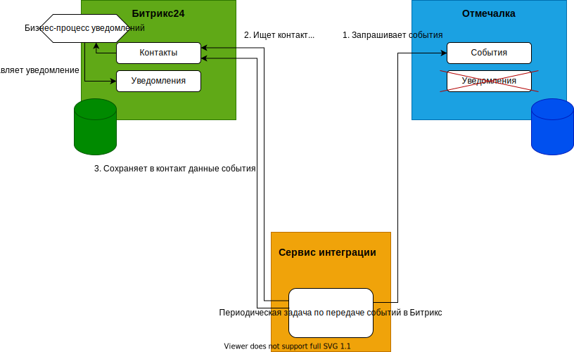

# Интеграция Bitrix24 и otmechalka.com (перенос отправки уведомлений из Отмечалки в Битрикс)

## Участники интеграции

- otmechalka.com
- Битрикс24
- Интеграционный сервис (ИС)

## Задачи интеграции

Отмечалка умеет информировать клиентов по смс о следующих событиях:

- На абонементе осталось одно занятие.
- Осталась неделя до окончания срока действия абонемента.
- Абонемент истек.

При этом нет возможности изменить каналы отправки, настроить язык или текст шаблонов для разных клиентов.

Необходимо перенести функцию информирования в Битрикс, т.к. там можно более гибко задавать каналы информирования, шаблоны сообщений, языки и т.д. Для этого нужен способ получать перечисленные события из Отмечалки и передавать их в Битрикс.

## Архитектура решения



- Отмечалка - генерирует события, по которым должно производиться информирование клиентов и предоставляет API для их получения.
- Битрикс24 - выполняет информирование клиентов по заданным каналам
- Интеграционный сервис (ИС) - прослойка, в которой находится логика интеграции и которая оркестрирует вызовы Битрикса и Отмечалки.

Непосредственно отправка уведомлений из Битрикса производится специально созданным бизнес-процессом, который автоматически реагирует на изменение данных контакта.

## Алгоритм работы ИС

1. ИС запрашивает в Битриксе последнюю временную отсечку, с которой нужно получать события в Отмечалке. Для хранения отсечки используется функциональность кастомных списков.

2. ИС запрашивает в Отмечалке список событий. События запрашиваются, начиная с определенного момента (отсечки):
   - С заданного момента времени. В этом случае если делать выборку по таймстампу по условию ">", то может возникнуть маловероятная ситуация, когда мы пропустим одно событие. Если же делать выборку по таймстампу по условию ">=", то гарантированно события, на которых ставится отсечка, будут получены более одного раза.
   - С заданного идентификатора (зависит от API Отмечалки).

    В результате Отмечалка возвращает список событий, каждое из которых имеет все необходимые [атрибуты](#атрибуты-события).

3. ИС сохраняет полученные данные в памяти. Постоянного хранилища у ИС нет.

4. ИС упорядочивает события по дате и времени наступления.

5. Последовательно для каждого события из упорядоченного списка ИС выполняет дальнейшие шаги алгоритма.

6. ИС ищет в Битриксе контакт, которому соответствует событие, согласно [алгоритму](#алгоритм-поиска-контакта)

7. Получает поля найденного контакта и определяет шаблон сообщения согласно [правилам выбора шаблона](#выбор-шаблона-сообщения).

8. ИС выполняет обновление полей найденного контакта согласно [правилам маппинга](#маппинг-полей). После этого в работу вступает бизнес-процесс уведомлений, который работает параллельно ИС.

9. ИС сохраняет новую отсечку (дату и время обработанного события либо его Id) в кастомном списке в Битриксе.

10. ИС переходит к обработке следующего события из списка, цикл повторяется.

### Атрибуты события

Событие должно содержать следующие атрибуты:

- Уникальный идентификатор события.
- ExternalId посетителя (соответствует Id контакта в Битриксе, может быть пустым)
- Дата и время, когда произошло событие.
- Тип события (последнее занятие, истекает срок и т.д.)
- Фамилия посетителя
- Имя посетителя
- Телефон
- Почта (может быть пустым):

### Алгоритм поиска контакта

1. ИС ищет в Битриксе контакт с Id, равным ExternalId из Отмечалки. Если контакт найден, то поиск прекращается и дальше используется этот контакт. Если не найден, то поиск продолжается на следующих шагах.
2. ИС ищет в Битриксе контакт по номеру телефона. Может быть найдено любое количество контактов (ноль и более).
3. ИС ищет в Битриксе контакт по почте. Может быть найдено любое количество контактов (ноль и более).
4. Если не найдено ни одного контакта, то сообщение не будет отправлено никому. Алгоритм завершается.
5. Если по телефону найден ровно один контакт, а по почте не найдено ничего, то поиск прекращается и дальше используется этот контакт.
6. Если по телефону контакт не найден, а по почте найден ровно один контакт, то поиск прекращается и дальше используется этот контакт.
7. Если количество найденных контактов больше одного, то осуществляются дальнейшие проверки для выбора между ними.
8. У каждого найденного контакта имя и фамилия ученика сверяется с именем и фамилией посетителя из Отмечалки. Сравнение происходит по принципу простого строкового равенства, никакие склонения и преобразования не используются. Если найден ровно один контакт, где оба поля совпадают, то поиск прекращается и дальше используется этот контакт.
9. Если ни один контакт не дал совпадения по имени и фамилии ученика, то в следующих шагах участвуют все контакты.
10. Если несколько контактов дали совпадения по имени и фамилии ученика, то в следующих шагах участвуют только эти контакты, остальные отбрасываются.
11. Среди оставшихся контактов выбирается тот, у которого есть наиболее свежая сделка. Если такой контакт существует, то поиск прекращается и дальше используется этот контакт.
12. Если вдруг и такой контакт не найден, то используется контакт с самой ранней датой создания.

### Выбор шаблона сообщения

Шаблон зависит от типа события и языка. Тип события возвращает Отмечалка. Язык определяется на основе продукта, указанного в карточке контакта в Битриксе. Если продукт "Онлайн школа", то используется русский язык. Если продукт "Зарубежное онлайн обучение", то используется английский язык. Если выбраны оба эти продукта или не выбран ни один из них, то по умолчанию используется русский язык.

Шаблоны перечислены [тут](https://docs.google.com/document/d/1ZhlXClER-9PByRUfqryllBO7fee6qq0eo-r-DV_bNXk/edit)

### Маппинг полей

Для того, чтобы бизнес-процесс мог отправить уведомление, необходимо заполнить следущие поля контакта:

- Шаблон сообщения (UF_CRM_1621937780)
- Язык (поле UF_CRM_1621937397)
- Id события (TODO указать поле)

## Известные проблемы

1. Если у контакта в Битриксе был изменен телефон при этом связи по Id нет, значит обновление телефона не было прокинуто в Отмечалку. Тогда при попытке отправить сообщение контакт вообще не будет найден.
2. Если у родителя два ребенка и у обоих в Отмечалке указан одинаковый номер телефона. Аналогично и в Битриксе есть два контакта, у которых указан одинаковый номер телефона. Связи с Отмечалкой по Id нет. Тогда при попытке отправить сообщение будет непонятно, какой контакт выбрать. Можно попробовать сопоставить имя посетителя в отмечалке с именем ученика в Битриксе, но и нет гарантии, что они совпадут (это касается старых контактов и новых, которые были созданы в отмечалке вручную). В результате может быть выбран не тот контакт. Хотя это не страшно, главное, что родитель будет проинформирован, а через какой контакт из двух не очень важно.

## Обработка аварийных ситуаций

Здесь рассматриваются ситуации падения процессов, сетевой недоступности и т.д. Аварией может быть:

- Завершение самого процесса ИС либо в результате падения либо в результате запланированного перезапуска.
- Недоступность Битрикса или Отмечалки, что приводит к завершению с ошибкой текущей итерации цикла

С т.з. отказоустойчивости система должна удовлетворять требованиям:

- Не терять сообщения.
- Не отправлять дубли сообщений.

ИС обрабатывает события последовательно и независимо друг от друга. Обработка каждый раз начинается с событий, произошедших после отсечки (см. [алгоритм](#алгоритм-работы-ис)). Если событие было обработано и его дата сохранена в качестве отсечке, то можно забыть про это событие, с ним уже все хорошо (по крайней мере с точки зрения ИС).

### Авария до отправки события в Битрикс

Если авария произошла после того, как ИС начал обрабатывать событие, но до того, как ИС сохранил данные о событии в Битриксе, то текущее событие и все остальные необработанные события будут получены и обработаны на следующей итерации цикла. Опасности что-то потерять или задублировать нет.

### Авария после отправки события в Битрикс

Если авария произошла после того, как ИС записал событие в Битрикс, но до того, как ИС сохранил в кастомном списке отсечку, соответствующую этому событию, то при следующем запуске цикла обработки текущее событие будет получено из Отмечалки повторно. В результате ИС еще раз запишет информацию о событии в Битрикс. Чтобы это не привело к повторной отправке сообщения клиенту нужно, чтобы бизнес-процесс уведомлений, ориентировался не на сами поля с информацией о событии, а на некоторое дополнительное поле. Для этого в контакте присутствуют два дополнительных поля:

- Id события. В это поле ИС сохраняет Id обрабатываемого события из отмечалки.
- Id последнего обработанного события. В этом поле бизнес-процесс уведомлений сохраняет Id события после успешной отправки сообщения.

Сигналом для отправки бизнес-процессу уведомлений будет отличие полей "Id события" и "Id последнего обработанного события". Если они различаются, значит поступила информация о новом событии и бизнес-процесс должен отправить новое сообщение. Таким образом, если ИС повторно обработает и запишет событие, то поля "Id события" и "Id последнего обработанного события" не будут отличаться и повторной отправки сообщения не произойдет.

### Авария после сохранения отсечки в Битриксе

Если авария произошла после сохранения отсечки в Битриксе, но до начала обработки следующего события, то все оставшиеся необработанные события будут получены и обработаны на следующей итерации цикла. Опасности что-то потерять или задублировать нет.

## API Отмечалки

Для получения событий из Отмечалки предлагается создать API примерно следующего вида.

Запрос:
`POST /api/notifications?from_id=<notification_id>`

либо

`POST /api/notifications?from_timestamp=<timestamp>`

В ответе возвращается массив событий, произошедших с переданной отсечки и отсортированый по дате события, начиная с самого старого:

``` json
{
    "count": 10,    // Количество событий в результирующем массиве
    "results": [
        {
            "id": 12345,                // Уникальный идентификатор события.
            "notification_type": 1,     // Тип события. 1 - осталось одно занятие, 2 - осталась неделя до окончания, 3 - абонемент истек.
            "visitor_ext_id": "39558",  // Внешний Id посетителя. Не обязательное поле.
            "last_name": "Петров",
            "first_name": "Василий",
            "phone": "79261234567",
            "email": "ivan.petrov@gmail.com",   // Не обязательное поле.
            "notification_dt": "2021-05-31T16:43:13Z"   // Дата и время события
        }
        ...
        // остальные события
    ]
}
```
